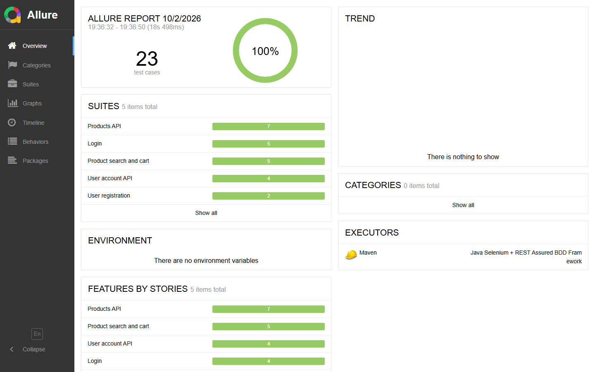

# Java Selenium + REST Assured BDD Framework

[](https://github.com/2hotluigi/java-selenium-restassured-framework/actions/workflows/tests.yml)
[](https://2hotluigi.github.io/java-selenium-restassured-framework/)

UI and API test automation framework for the public demo store
[automationexercise.com](https://automationexercise.com), built with **Java 21, Selenium WebDriver,
Cucumber (BDD), TestNG and REST Assured**, reported with **Allure** and running on **GitHub Actions**.

📊 **[Latest Allure report](https://2hotluigi.github.io/java-selenium-restassured-framework/)**

[](https://2hotluigi.github.io/java-selenium-restassured-framework/)

## What it shows

| Area | Implementation |
|------|----------------|
| UI testing | Selenium WebDriver 4, Page Object Model, explicit waits only (no `Thread.sleep`) |
| API testing | REST Assured clients, JSON Schema validation, Jackson models, positive and negative cases |
| BDD | Cucumber features in Gherkin, Scenario Outlines, data tables, tags (`@smoke`, `@regression`, `@ui`, `@api`) |
| Hybrid tests | UI scenarios create their test users through the API: faster and independent |
| Parallel execution | Scenarios run in parallel with TestNG; state is scenario-scoped via PicoContainer DI |
| Test data | Unique users generated with Datafaker, cleaned up automatically after each scenario |
| Cross-browser | Chrome, Firefox and Edge, local or on Selenium Grid (Docker); CI runs the UI suite on all three in parallel |
| Reporting | One Allure report for every browser, grouped as API / UI · Chrome / UI · Firefox / UI · Edge, with steps, API request/response attachments, a screenshot inside every passed UI step, screenshots on failure, environment and history trend |
| CI/CD | GitHub Actions matrix (API once, UI per browser) on every push and PR, weekly schedule, manual runs by tag, merged report published to GitHub Pages |

## Tech stack

Java 21 · Maven · Selenium 4 · Cucumber 7 · TestNG · REST Assured 5 · AssertJ · Jackson · Datafaker · Allure · GitHub Actions · Docker

## Project structure

```
src/test/java/com/luisabrego/automation
├── api/            REST Assured clients (ProductsApi, UserApi) and response models
├── config/         ConfigReader: config.properties < env variables < -D system properties
├── context/        TestContext shared between steps (driver, last response, test user)
├── driver/         DriverFactory: local / remote browsers, headless, ad blocking; per-thread CurrentDriver
├── hooks/          Screenshot on failure, browser shutdown, test data clean-up
├── pages/          Page Objects (BasePage holds the synchronized interactions)
├── reporting/      Cucumber plugin that attaches a screenshot to every passed UI step
├── runners/        TestNG + Cucumber runner with parallel scenarios
├── steps/          Step definitions (api, ui, common)
└── utils/          Test data factory
src/test/resources
├── features/       Gherkin features (api/, ui/)
├── schemas/        JSON Schemas for contract validation
└── config.properties
```

## Running the tests

Requirements: JDK 21+ and Chrome. Maven is not needed: the Maven Wrapper (`mvnw`) downloads the right
version on the first run, and Selenium Manager downloads the browser drivers.

On Windows, use `.\mvnw` (PowerShell) or `mvnw` (cmd) instead of `./mvnw`.

```bash
# All scenarios
./mvnw test

# Only API or only UI
./mvnw test -Dcucumber.filter.tags="@api"
./mvnw test -Dcucumber.filter.tags="@ui"

# Smoke suite, headless, 4 parallel threads
./mvnw test -Dcucumber.filter.tags="@smoke" -Dheadless=true -Dthreads=4

# Another browser
./mvnw test -Dbrowser=firefox
./mvnw test -Dbrowser=edge

# Without the screenshots of passed steps (faster, smaller report)
./mvnw test -Dscreenshot.passed.steps=false
```

### Selenium Grid with Docker

```bash
docker compose up -d   # hub + Chrome, Firefox and Edge nodes
./mvnw test -Dgrid.url=http://localhost:4444 -Dbrowser=firefox
```

### Allure report

```bash
./mvnw allure:serve
```

## Design notes

- **The API under test always returns HTTP 200.** The real status is in the `responseCode` field of the
  body, and the content type is `text/html`. The framework checks both and parses the body as JSON
  explicitly (`ApiResponses`).
- **Ads on the demo site** cover elements and open random pop-up pages. The same list of ad hosts is
  blocked in every browser: Chrome and Edge resolve them to localhost (`--host-resolver-rules`), and
  Firefox sends them to a closed port through an inline proxy auto-config (PAC) script.
- **Cross-browser results in one report.** Allure identifies a scenario by its file and line, so the
  same scenario run on two browsers would be merged as retries. A `@Before` hook adds the browser as a
  parameter and to the history id of UI scenarios, and groups the Suites tab by layer and browser.
- **A screenshot inside every passed step.** So a manual review of the report can confirm what each
  step did, `StepScreenshotPlugin` listens to Cucumber's step-finished event and is registered before
  the Allure plugin, so the step is still open in Allure and the image lands inside it. An
  `@AfterStep` hook would run after Allure closed the step and show up as an extra step instead.
  Cucumber delivers events under a lock, so the screenshots add ~15% to a UI run; turn them off with
  `-Dscreenshot.passed.steps=false`.
- **API-first setup.** UI scenarios that need an existing account create it through the API and
  delete it in an `@After` hook, so every scenario is independent and can run in parallel.

## Author

**Luis Abrego**, QA Automation Engineer / SDET · [LinkedIn](https://www.linkedin.com/in/luis-abrego-h)
